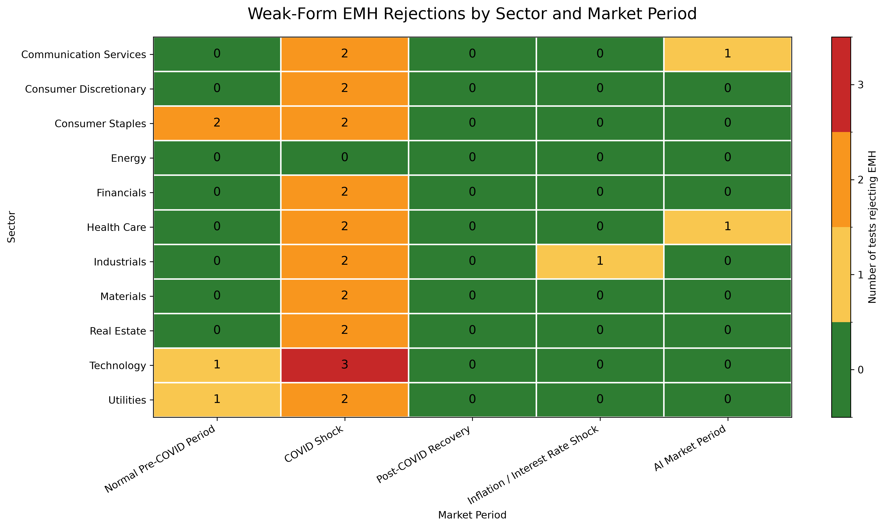

# Finance Research

## Weak-Form EMH Sector Analysis

This project tests weak-form market efficiency across major U.S. SPDR sector ETFs and distinct market environments using:

- Variance Ratio Test
- Lag-1 Autocorrelation Test
- Runs Test

Each test uses a 5% significance level. A value of 0 in the heatmap means no tests rejected weak-form EMH for that sector-period pair; a value of 3 means all three tests rejected weak-form EMH.



### Outputs

- [Detailed sector-period results](outputs/sector_emh_detailed_results.md)
- [Detailed results CSV](outputs/sector_emh_detailed_results.csv)
- [Summary matrix CSV](outputs/sector_emh_summary_matrix.csv)
- [Period summary CSV](outputs/sector_emh_period_summary.csv)
- [Heatmap PNG](outputs/sector_emh_heatmap.png)

### Run Locally

```bash
python -m pip install -r requirements.txt
python sector_emh_analysis.py
```
