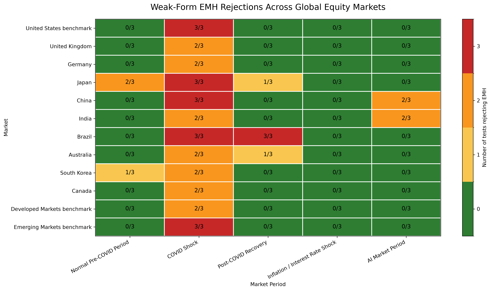
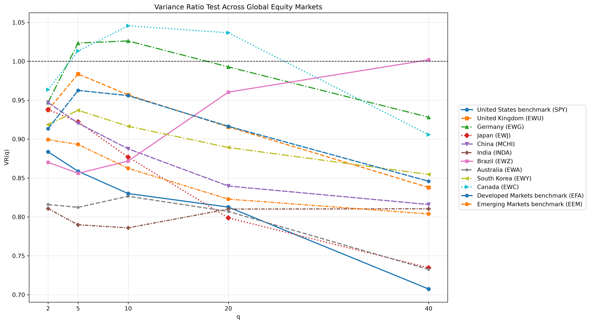

# Finance Research

## International Market Efficiency Analysis

This analysis compares weak-form market efficiency across broad-market ETFs for the United States, major non-U.S. equity markets, developed markets, and emerging markets.

It uses the same weak-form EMH tests and 5% significance level used elsewhere in this repository:

- Variance Ratio Test
- Lag-1 Autocorrelation Test
- Runs Test

The analysis downloads daily adjusted close data for 2015-01-01 through 2024-12-31, verifies every ticker has sufficient valid data, and then compares markets across the same market periods used by the U.S. sector analysis. Each ETF is evaluated on its own valid trading observations; markets are not forced onto a common date intersection.

Failure to reject weak-form EMH is treated only as insufficient evidence against weak-form EMH, not as proof that EMH is true.





### International Outputs

- [Detailed international EMH results](outputs/international_emh/international_emh_detailed_results.csv)
- [Country-by-period rejection matrix](outputs/international_emh/international_emh_summary.csv)
- [Summary comparison table](outputs/international_emh/international_emh_summary.md)

### Run Locally

```bash
python -m pip install -r requirements.txt
python international_emh_analysis.py
```
