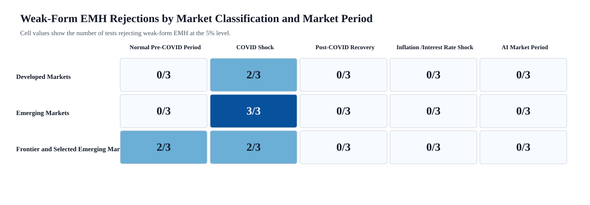
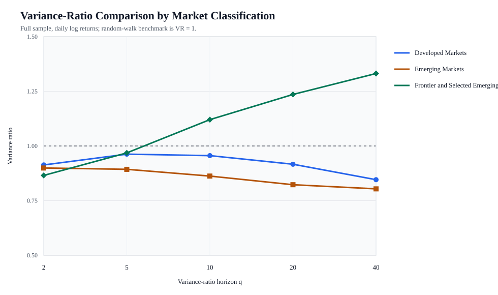

# Market Classification Analysis

Data source: Yahoo Finance daily adjusted-close data, 2015-01-01 to 2024-12-31.

## Market Periods

| period | start | end |
| --- | --- | --- |
| Normal Pre-COVID Period | 2019-01-01 | 2019-12-31 |
| COVID Shock | 2020-02-01 | 2021-03-31 |
| Post-COVID Recovery | 2021-04-01 | 2021-12-31 |
| Inflation / Interest Rate Shock | 2022-01-01 | 2022-12-31 |
| AI Market Period | 2023-01-01 | 2024-12-31 |

## Methodology Notes

- Developed Markets uses EFA.
- Emerging Markets uses EEM.
- Fewer than four reliable frontier-country instruments were available, so FM is used and labeled Frontier and Selected Emerging Markets. FM is not a pure frontier-market benchmark because it includes selected emerging-market exposure.
- Daily log returns are used for all tests.
- A 5% significance level is used.
- Failure to reject weak-form EMH is interpreted as insufficient evidence against weak-form EMH, not proof that the market is efficient.

## Data Quality Table: Frontier Candidates

| ticker | country_or_market | first_valid_date | last_valid_date | observations | max_gap_days | included | reason |
| --- | --- | --- | --- | --- | --- | --- | --- |
| VNM | Vietnam | 2015-01-02 | 2024-12-31 | 2516 | 4 | No | Reliable, but not included in the final analysis because fewer than four reliable frontier-country instruments were available; FM fallback used |
| PAK | Pakistan | 2015-04-22 | 2024-03-05 | 2233 | 4 | No | Last valid date does not cover the full analysis period |
| BTBETRETF.RO | Romania |  |  | 0 |  | No | No adjusted-close observations in sample |
| GLCR | Iceland |  |  | 0 |  | No | Yahoo download failed: HTTP Error 400: Bad Request |
| 0LLQ.L | Vietnam | 2018-01-29 | 2024-12-31 | 774 | 168 | No | Insufficient observations: 774 < 800 |
| 2804.HK | Vietnam | 2019-07-16 | 2024-12-31 | 1347 | 6 | No | Listing date misses the beginning of the regime sample |
| 00885.TW | Vietnam | 2021-03-30 | 2024-12-31 | 917 | 13 | No | Listing date misses the beginning of the regime sample |
| FRN | Frontier multi-country | 2015-01-02 | 2020-11-24 | 1458 | 5 | No | Not a single-country frontier instrument |
| NGE | Nigeria | 2015-01-02 | 2024-03-28 | 2325 | 4 | No | Checked but not used as a current pure MSCI frontier-country proxy |
| EGPT | Egypt | 2015-01-02 | 2024-04-04 | 2329 | 4 | No | Checked but not used as a current pure MSCI frontier-country proxy |
| ARGT | Argentina | 2015-01-02 | 2024-12-31 | 2516 | 4 | No | Checked but not used as a current pure MSCI frontier-country proxy |
| KWT | Kuwait | 2020-09-03 | 2024-12-31 | 1088 | 4 | No | Checked but not used as a current pure MSCI frontier-country proxy |

## Instruments Used

| market_classification | ticker | country_or_market | first_valid_date | last_valid_date | observations | note |
| --- | --- | --- | --- | --- | --- | --- |
| Developed Markets | EFA | Developed Markets | 2015-01-02 | 2024-12-31 | 2516 | iShares MSCI EAFE ETF; developed markets ex-US and Canada |
| Emerging Markets | EEM | Emerging Markets | 2015-01-02 | 2024-12-31 | 2516 | iShares MSCI Emerging Markets ETF |
| Frontier and Selected Emerging Markets | FM | Frontier and Selected Emerging Markets | 2015-01-02 | 2024-12-31 | 2516 | iShares Frontier and Select EM ETF fallback; not a pure frontier-market benchmark |

## Weak-Form EMH Rejections by Market Classification and Market Period

| Market Classification | Normal Pre-COVID Period | COVID Shock | Post-COVID Recovery | Inflation / Interest Rate Shock | AI Market Period |
| --- | --- | --- | --- | --- | --- |
| Developed Markets | 0/3 | 2/3 | 0/3 | 0/3 | 0/3 |
| Emerging Markets | 0/3 | 3/3 | 0/3 | 0/3 | 0/3 |
| Frontier and Selected Emerging Markets | 2/3 | 2/3 | 0/3 | 0/3 | 0/3 |

## Variance-Ratio Graph

## Detailed Results

The detailed test statistics, p-values, observations, and rejection decisions are available in `market_classification_detailed_test_results.csv`.

## Interpretation and Adaptive Markets Hypothesis

The rejection pattern changes by regime and by market classification. During the COVID Shock, the counts are Developed Markets: 2/3, Emerging Markets: 3/3, Frontier and Selected Emerging Markets: 2/3; in the Normal Pre-COVID Period, the counts are Developed Markets: 0/3, Emerging Markets: 0/3, Frontier and Selected Emerging Markets: 2/3. No tests reject weak-form EMH in the Post-COVID Recovery, Inflation / Interest Rate Shock, or AI Market Period windows. This is consistent with the Adaptive Markets Hypothesis: return predictability is conditional on market environment, and developed, emerging, and frontier-proxy markets do not respond identically to shocks.

The results should not be read as evidence that frontier markets are inherently less efficient. The frontier proxy is constrained by investable ETF availability, and the statistical rejection count varies by regime rather than moving monotonically by development level.

## Methodology Limitations

1. EFA represents developed markets excluding the United States and Canada.
2. EEM is an investable ETF proxy rather than the underlying MSCI Emerging Markets Index.
3. A custom frontier portfolio may not cover every MSCI frontier market because of limited Yahoo Finance data.
4. Country ETFs may contain tracking error, fees, currency exposure, and differences in liquidity.
5. FM, when used, includes frontier and selected emerging-market exposure and is therefore not a perfectly pure frontier benchmark.

## Output Files

- `market_classification_detailed_test_results.csv`
- `market_classification_emh_rejection_summary.csv`
- `market_classification_data_quality_table.csv`
- `market_classification_instruments_used.csv`
- `variance_ratio_by_market_classification.csv`
- `market_classification_emh_rejection_heatmap.svg`
- `variance_ratio_by_market_classification.svg`
